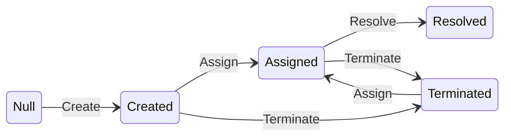
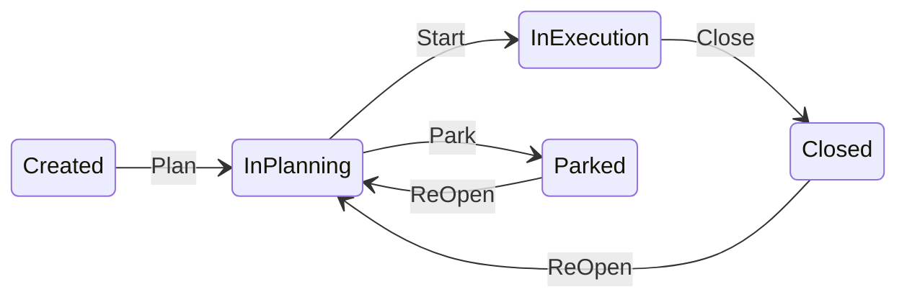
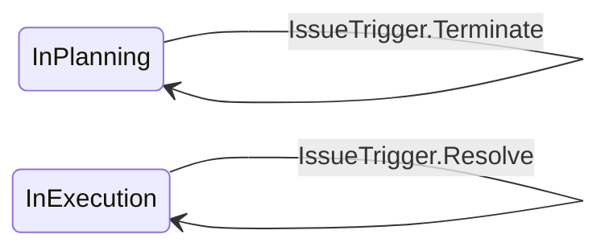

# A lightweight Finite State Machine in C#

**Workflow is a common business logic problem** in software development. For example, the diagram below is a workflow for an issue tracking application.


**Workflows are essentially graphs** with each permitted state transition represented by an edge. This is apparent when we look at the mermaid code for the diagram above. It is simply a flat collection of the state transitions specified as `src-state` --> `dst-state` : `trigger`. 
```
Null --> Created : Create
Created --> Assigned : Assign
Created --> Terminated : Terminate
Assigned --> Resolved : Resolve
Assigned --> Terminated : Terminate
Terminated --> Assigned : Assign
```

**DotFSM allows defining `Finite State Machines` as a collection of state transitions.** For example, the above state machine can be defined like below
```
new DotFSM<State, Trigger>(new Transition<State, Trigger>[]
{
    new () {SourceState = State.Null       ,Trigger = Trigger.Create    , DestinationState = State.Created     },
    new () {SourceState = State.Created    ,Trigger = Trigger.Assign    , DestinationState = State.Assigned    },
    new () {SourceState = State.Created    ,Trigger = Trigger.Terminate , DestinationState = State.Terminated  },
    new () {SourceState = State.Assigned   ,Trigger = Trigger.Resolve   , DestinationState = State.Resolved    },
    new () {SourceState = State.Assigned   ,Trigger = Trigger.Terminate , DestinationState = State.Terminated  },
    new () {SourceState = State.Terminated ,Trigger = Trigger.Assign    , DestinationState = State.Assigned    },
})
```
**DotFSM also comes with a builder** which allows specifying the above state machine as below, which is subjectively easier to read.
```
Builder<State, Trigger>
    .Start(State.Created)
        .Allow(Trigger.Assign, State.Assigned)
        .Allow(Trigger.Terminate, State.Terminated)
    .ForState(State.Assigned)
        .Allow(Trigger.Resolve, State.Resolved)
        .Allow(Trigger.Terminate, State.Terminated)
    .ForState(State.Terminated)
        .Allow(Trigger.Assign, State.Assigned)
    .Build();
```

**Exercising the state machine is simply a search of the matching edge in the graph**. If a transition is permitted, the search function returns a `DotFSM.Transition`, or otherwise a `null` value.
```
    var transition = EvaluateWorkflow(workflowDefinition, issue.CurrentWorkflowState, trigger);
    if (transition == null)
    {
        throw new IssueWorkflowException($"{trigger} is not allowed for {issue}");
    }
    return issue with { CurrentWorkflowState = transition.DestinationState };
```

**Workflows may need to be composed in real world applications**. Suppose the issue tracking application also need to deal with projects. And the project follows the workflow below

In addition, actions to the issues are only allowed in certain project states. For example, `InPlanning` state allows `Create` and `Terminate` an issue. And `InExecution` state allows `Assign`, `Terminate`, and `Resolve` an issue. The workflow is illusated below

Suppose the first workflow is defined in C# as `IssueWorkflow` and the second one as `ProjectIssueWorkflow`. The `IssueTrigger` needs to follow both. This can be done as a combination of the two as below.
```
  var workflow = ProjectIssueWorkflow.Combine(IssueWorkflow);
```
The new workflow can then be exercised as to any other `DotFSM` instances.
```
var transition = workflow.GetTransition(currentState, trigger)
```
with `currentState` being type `(ProejctState, IssueState)`


**A complete console application** that moves both the project and issue between states according the workflow defininitions above can be as simple as the code below
```
var (context, command) = ParseCommand(line);
switch (context)
{
    case "project":
        {
            var trigger = command.ToEnum<ProjectTrigger>() ?? throw new CommandLineParsingException($"unknown command {command}");
            var updatedProject = ProjectWorkflowService.FireTrigger(_project, trigger);
            _project = updatedProject;
            break;
        }
    case "issue":
        {
            var trigger = command.ToEnum<IssueTrigger>() ?? throw new CommandLineParsingException($"unknown command {command}");
            var updatedProject = IssueWorkflowService.FireTrigger(_project, trigger);
            _project = updatedProject;
            break;
        }
    default:
        {
            throw new CommandLineParsingException($"Invalid context {context}. Only 'Proejct' and 'Issue' are valid");
        }
} 
```
