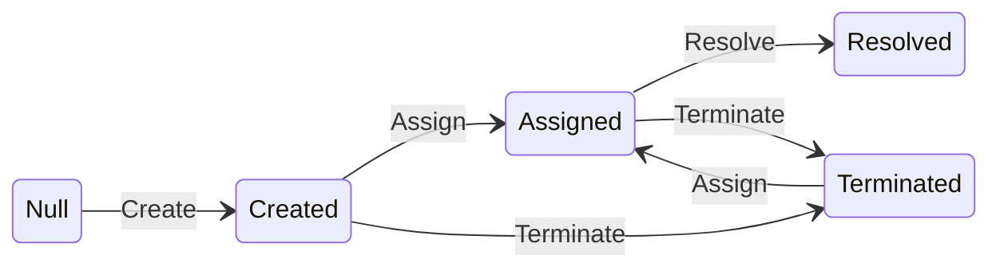

# A lightweight Finite State Machine in C#

**Workflow is a common business logic problem** in software development. For example, the diagram below is a workflow for an issue tracking application.


**Workflows are essentially graphs** with each permitted state transition represented by an edge. This is apparent when we look at the mermaid code for the diagram above. It is simply a flat collection of the state transitions specified as `src-state` --> `dst-state` : `trigger`. 
```
Null --> Created : Create
Created --> Assigned : Assign
Created --> Terminated : Terminate
Assigned --> Resolved : Resolve
Assigned --> Terminated : Terminate
Terminated --> Assigned : Assign
```

**DotFSM allows you to define `Finite State Machines` as a collection of state transitions.** For example, the above state machine can be defined like below
```
new DotFSM<State, Trigger>(new Transition<State, Trigger>[]
{
    new () {SourceState = State.Null       ,Trigger = Trigger.Create    , DestinationState = State.Created     },
    new () {SourceState = State.Created    ,Trigger = Trigger.Assign    , DestinationState = State.Assigned    },
    new () {SourceState = State.Created    ,Trigger = Trigger.Terminate , DestinationState = State.Terminated  },
    new () {SourceState = State.Assigned   ,Trigger = Trigger.Resolve   , DestinationState = State.Resolved    },
    new () {SourceState = State.Assigned   ,Trigger = Trigger.Terminate , DestinationState = State.Terminated  },
    new () {SourceState = State.Terminated ,Trigger = Trigger.Assign    , DestinationState = State.Assigned    },
})
```
**DotFSM also comes with a builder** which allows specifying the above state machine as below, which is subjectively easier to read.
```
Builder<State, Trigger>
    .Start(State.Created)
        .Allow(Trigger.Assign, State.Assigned)
        .Allow(Trigger.Terminate, State.Terminated)
    .ForState(State.Assigned)
        .Allow(Trigger.Resolve, State.Resolved)
        .Allow(Trigger.Terminate, State.Terminated)
    .ForState(State.Terminated)
        .Allow(Trigger.Assign, State.Assigned)
    .Build();
```

Once a state machine is defined, exercising it is as simple as firing triggers into the state machine and getting either a `DotFSM.Transition` back if the trigger is allowed or `null` if it is not permitted.
```
    var transition = EvaluateWorkflow(workflowDefinition, issue.CurrentWorkflowState, trigger);
    if (transition == null)
    {
        throw new IssueWorkflowException($"{trigger} is not allowed for {issue}");
    }
    return issue with { CurrentWorkflowState = transition.DestinationState };
```

**A complete console application** that moves issues between states according to the workflow diagram above can be as simple as below
```
using IssueTracker;

var issue = new Issue()
{
    Workflow = WorkflowDefinitions.ComplexWorkflow
};

Console.WriteLine(" --- Current workflow definition ---");
Console.WriteLine(issue.Workflow.ToMermaidDiagram());
Console.WriteLine("------------------------------------");

while (true) 
{
    Console.WriteLine($"Current state: {issue.CurrentWorkflowState}");
    Console.WriteLine($"Commands allowed:  Exit, {string.Join(",", issue.Workflow.AllowedTriggers(issue.CurrentWorkflowState))}");
    var line = Console.ReadLine();
    if ("exit".Equals(line, StringComparison.OrdinalIgnoreCase))
    {
        return;
    }

    var trigger = line.ToEnum<Trigger>();
    if (trigger == null) 
    {
        Console.WriteLine($"unknown command {line}");
        continue;
    }

    try
    {
        var updatedIssue = IssueWorkflowService.FireTrigger(issue, trigger.Value);
        issue = updatedIssue;
    }
    catch (IssueWorkflowException e)
    {
        Console.WriteLine(e.Message);
    }
}
```
